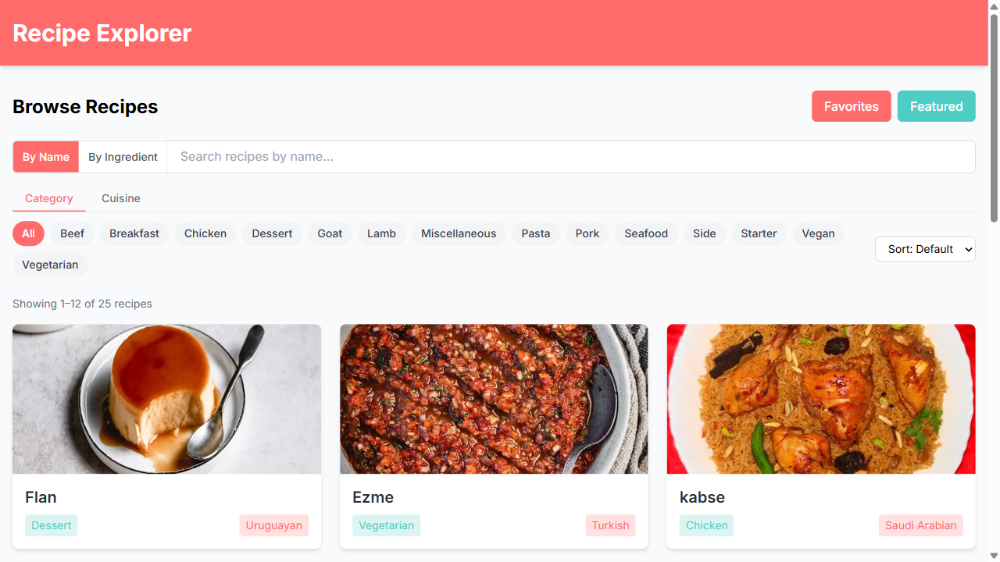

# Recipe Explorer


A full-featured recipe discovery app built with **Next.js 15**, **React Query**, and **Tailwind CSS**. Browse, search by name or ingredient, filter, sort, and save your favourite recipes — no database required.

**Live Demo:** [recipe-explorer-five.vercel.app](https://recipe-explorer-five.vercel.app/)



## Features

- **Search by name or ingredient** — toggle between name-based and ingredient-based search modes using the TheMealDB filter API
- **Category filters** — browse recipes by category (Beef, Chicken, Pasta, Seafood, and more)
- **Sort options** — sort results A → Z or Z → A
- **Recipe detail pages** — ingredients list with image fallback, step-by-step instructions, and YouTube tutorial links
- **Related recipes** — discover similar dishes from the same category on every recipe page
- **Favourites** — save recipes to a personal favourites list (persisted in localStorage)
- **Feedback & ratings** — leave star ratings and comments on any recipe with client-side validation
- **Featured recipes** — a curated hand-picked collection powered by a simple ID list
- **SEO ready** — dynamic page titles, Open Graph tags, Twitter cards, and JSON-LD structured data on every recipe page
- **Skeleton loading** — animated placeholder cards during data fetches
- **Error boundary** — graceful crash recovery via Next.js `error.tsx`
- **Custom 404** — friendly not-found page for unknown recipe IDs
- **Responsive** — mobile-first design, tested across breakpoints

## Tech Stack

| Technology | Purpose |
|-----------|---------|
| [Next.js 15](https://nextjs.org/) | React framework with App Router, server components, generateMetadata |
| [React Query v5](https://tanstack.com/query) | Server state management, caching, parallel queries |
| [Tailwind CSS](https://tailwindcss.com/) | Utility-first styling |
| [TypeScript](https://www.typescriptlang.org/) | Full type coverage |
| [TheMealDB API](https://www.themealdb.com/api.php) | Recipe data source (free, no auth required) |
| [Vitest](https://vitest.dev/) | Unit testing (30 tests) |
| [react-hot-toast](https://react-hot-toast.com/) | Toast notifications |

## Getting Started

### Prerequisites

- Node.js 18+
- npm

### Installation

```bash
git clone https://github.com/faizkhairi/recipe-explorer.git
cd recipe-explorer
npm install
```

### Development

```bash
npm run dev
```

Open [http://localhost:3000](http://localhost:3000) in your browser.

### Testing

```bash
npm test             # Run all 30 tests once
npm run test:watch   # Watch mode
```

### Build

```bash
npm run build
npm start
```

## Project Structure

```
recipe-explorer/
├── app/
│   ├── page.tsx                    # Home — search, ingredient filter, sort, pagination
│   ├── layout.tsx                  # Root layout, global metadata, OG tags
│   ├── error.tsx                   # Error boundary (catches unhandled throws)
│   ├── not-found.tsx               # Custom 404 page
│   ├── loading.tsx                 # Route-level skeleton loading
│   ├── favorites/page.tsx          # Saved favourites page
│   └── recipes/
│       ├── page.tsx                # Featured recipes (curated list)
│       └── [id]/
│           ├── page.tsx            # Server component: generateMetadata + JSON-LD
│           └── RecipeDetailClient.tsx  # Client component: interactive detail view
├── components/
│   ├── RecipeCard.tsx              # Recipe grid card with favourite toggle
│   ├── IngredientsList.tsx         # Ingredient list with per-image error fallback
│   ├── FeedbackForm.tsx            # Rating + review form with validation
│   ├── FeedbackList.tsx            # Display submitted reviews
│   ├── FavoriteButton.tsx          # Heart toggle button
│   ├── LoadingSpinner.tsx          # Inline loading indicator
│   ├── ErrorDisplay.tsx            # Error state with retry button
│   └── QueryProvider.tsx           # React Query provider wrapper
├── hooks/
│   ├── useRecipes.ts               # Recipe hooks (search, detail, category, ingredient)
│   ├── useFavorites.ts             # localStorage favourites management
│   ├── useFeedback.ts              # localStorage feedback management
│   └── useCuratedRecipes.ts        # Parallel fetch for featured recipe list
├── lib/
│   ├── api.ts                      # TheMealDB API client (6 functions)
│   ├── types.ts                    # TypeScript interfaces
│   ├── curatedRecipes.ts           # IDs of hand-picked featured recipes
│   └── sampleRecipes.ts            # Offline fallback recipes
└── tests/
    ├── setup.ts                    # Test configuration + localStorage mock
    ├── api.test.ts                 # API function tests (10 tests)
    ├── favorites.test.ts           # Favourites hook tests (5 tests)
    ├── feedback.test.ts            # Feedback hook tests (3 tests)
    ├── ingredient-search.test.ts   # Ingredient search API tests (5 tests)
    └── validation.test.ts          # Feedback form validation tests (7 tests)
```

## Architecture Notes

### Server + Client Split (Recipe Detail)

The recipe detail page uses a server/client component split to enable both dynamic metadata and interactive features:

- `app/recipes/[id]/page.tsx` — **server component**: fetches recipe + related recipes on the server, exports `generateMetadata` for SEO, injects JSON-LD structured data
- `app/recipes/[id]/RecipeDetailClient.tsx` — **client component**: handles favourites, feedback, and interactive UI

This means the browser tab shows the correct recipe title on first load (no waiting for client JS), and recipe pages are eligible for Google rich snippets.

### Data Fetching Strategy

React Query manages all client-side state with 5-minute caching. `useQueries` (plural) fetches the curated recipe list in parallel — 12 simultaneous requests, each independently cached.

### Adding Featured Recipes

Find a recipe on [TheMealDB](https://www.themealdb.com), note its ID from the URL, and add it to `lib/curatedRecipes.ts`:

```ts
export const curatedRecipeIds: string[] = [
  '52772', // Teriyaki Chicken Casserole
  '12345', // Your new recipe
];
```

### TheMealDB API Endpoints Used

| Endpoint | Purpose |
|----------|---------|
| `/search.php?s=` | Browse all / search by name |
| `/lookup.php?i={id}` | Recipe details |
| `/list.php?c=list` | List all categories |
| `/filter.php?c={category}` | Filter by category |
| `/filter.php?i={ingredient}` | Filter by ingredient |

## License

MIT
